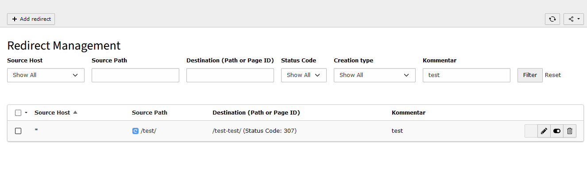

# EXT:redirect_comments

## install

`composer require andersundsehr/redirect-comments`

It adds a field `comments` to the `sys_redirects` table and adds the possibility to filter by comments in the backend.

it also changes the label from "Target" to "Destination (Path or Page Id)" to make it more clear what the field is for.

# with ♥️ from anders und sehr GmbH

> If something did not work 😮  
> or you appreciate this Extension 🥰 let us know.

> We are hiring https://www.andersundsehr.com/karriere/

